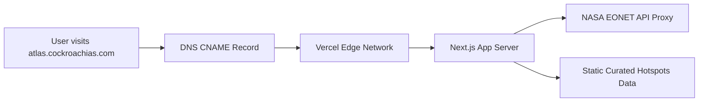

# OPTION 1: SUBDOMAIN DEPLOYMENT GUIDE
## COCKROACHIAS 3D WORLD ATLAS

This guide explains how to deploy your newly pushed **Cockroach3DAtlas** Next.js codebase to **Vercel** and link it to your custom subdomain (e.g., `atlas.cockroachias.com`).

---

## Architecture Overview



By deploying the 3D Atlas as a standalone application on a subdomain, you keep the complex WebGL/Three.js scripts isolated. This ensures your main site loads quickly while the Atlas operates independently with its own versioning, scaling, and build environments.

---

## Step-by-Step Deployment Process

### Step 1: Deploy the Codebase on Vercel

1. Log into your **[Vercel Account](https://vercel.com/)** (sign in using your GitHub account for automatic integration).
2. On your Vercel Dashboard, click **Add New** and select **Project**.
3. Under **Import Git Repository**, locate your repository: `sanjucockroach/cockroach3DAtlas`. Click **Import**.
4. In the **Configure Project** settings:
   * **Framework Preset:** Vercel will automatically detect `Next.js`. Keep this preset.
   * **Root Directory:** Keep as `./` (default).
   * **Build and Output Settings:** Keep default options (`npm run build`).
   * **Environment Variables:** You do not need to configure any variables for the database since we have set it to relative, but if you have a production URL or analytics tags, you can add them here.
5. Click **Deploy**.
6. Wait for Vercel to compile and deploy your site (takes ~2 minutes). Once complete, you will get a default `.vercel.app` staging URL.

---

### Step 2: Configure your Custom Domain in Vercel

1. On your Vercel project page, go to **Settings** (top navigation tab) and select **Domains** from the left sidebar.
2. In the input box, type your desired custom subdomain (e.g., `atlas.cockroachias.com`).
3. Click **Add**.
4. Vercel will prompt you to choose the redirect behavior: select **"Do not redirect"** (since this is a standalone atlas app) and click **Add**.
5. The domain list will now show `atlas.cockroachias.com` with a status of `Invalid Configuration` (red label). Vercel will show the DNS records required:
   * **Type:** `CNAME`
   * **Name:** `atlas`
   * **Value:** `cname.vercel-dns.com`

---

### Step 3: Configure DNS Records in Your Domain Registrar

1. Log in to your domain management dashboard (where you bought `cockroachias.com`, e.g., **Cloudflare, GoDaddy, Namecheap, or Hostinger**).
2. Go to the **DNS Settings** or **DNS Zone File Editor** for `cockroachias.com`.
3. Add a new DNS record with the following parameters:
   * **Record Type:** `CNAME`
   * **Host/Name:** `atlas` (this automatically prefixes your domain to create `atlas.cockroachias.com`)
   * **Target/Points to/Value:** `cname.vercel-dns.com`
   * **TTL:** Keep default (e.g., 3600 seconds or Automatic).
   * **Proxy Status (If using Cloudflare):** You can set this to **DNS Only** (recommended to bypass Cloudflare caching on HTML streams) or **Proxied** (if you need Cloudflare SSL/security protection).
4. Save the record.

---

### Step 4: Verification and SSL Generation

1. Return to your Vercel dashboard domain settings.
2. Click **Refresh**.
3. Once DNS propagation is complete (usually within 1–15 minutes), the label will turn green showing `Active`.
4. Vercel will automatically generate a free **Let's Encrypt SSL certificate** for your subdomain, enabling `https://atlas.cockroachias.com`.

---

### Step 5: Link the Atlas from Your Main Website

To make the atlas accessible to your visitors:
1. Log in to the codebase or editor for your **primary hosted website**.
2. Locate the navigation header or menu code.
3. Add a new menu item pointing directly to your subdomain:
   ```html
   <a href="https://atlas.cockroachias.com" target="_blank" rel="noopener noreferrer">World Atlas</a>
   ```
4. Save and deploy your main website.

---

## Maintaining the Subdomain
Whenever you want to update the monthly news or edit details:
1. Make your changes locally in `/src/data/atlas/hotspots.ts` as outlined in the monthly updates playbook.
2. Commit and push the changes to your GitHub repository:
   ```bash
   git add src/data/atlas/hotspots.ts
   git commit -m "update: monthly UPSC hotspots update"
   git push origin main
   ```
3. Vercel will automatically detect the git push, rebuild the site, and update the live subdomain at `atlas.cockroachias.com` within 90 seconds. No manual intervention or server command is required.
